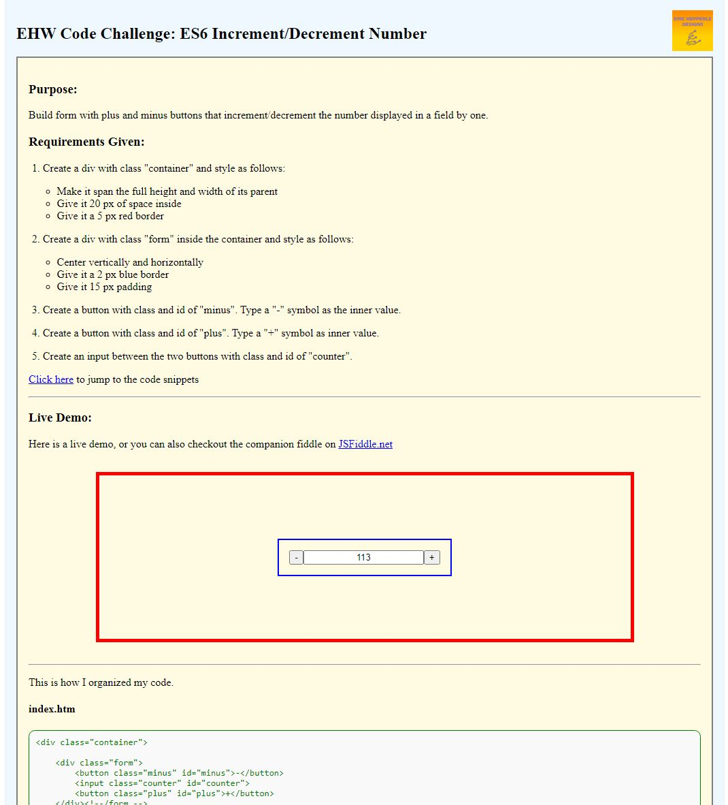

<!--
*** Readme.md by Eric L. Hepperle
*** Inspired by the Best-README-Template at:
*** https://github.com/othneildrew/Best-README-Template
*** Date Created: 02/26/22
-->

<!-- PROJECT SHIELDS -->
<!--
*** I'm using markdown "reference style" links for readability.
*** Reference links are enclosed in brackets [ ] instead of parentheses ( ).
*** See the bottom of this document for the declaration of the reference variables
*** for contributors-url, forks-url, etc. This is an optional, concise syntax you may use.
*** https://www.markdownguide.org/basic-syntax/#reference-style-links
-->
[![Contributors][contributors-shield]][contributors-url]
[![Forks][forks-shield]][forks-url]
[![Stargazers][stars-shield]][stars-url]
[![Issues][issues-shield]][issues-url]
[![MIT License][license-shield]][license-url]
[![LinkedIn][linkedin-shield]][linkedin-url]

<!-- PROJECT LOGO -->
 

  

<h1 align="center">Eric Hepperle Designs:</h1>

<h2 align="center">Mobile First UX Web Design Grid Template [2022]</h2>

<h3 align="center">Created with: [Figma]</h3>

This 3-panel web design template gives you a good starting place to mock-up your newest UX/UI and Web Design ideas! Each panel has both column and row grids for vertical harmony as well as horizontal. One caveat -- it is static, not "responsive".

Hi, I'm Eric and I'm new to UX Design. This is my very first contribution to the Figma community. I hope you like it and that it can help you get started with your mobile-first web designs.

    <a href="https://github.com/codewizard13/ehw-fig-mobile-first-grid-template"><strong>Explore the docs »</strong></a>
     
     
    <a href="https://erichepperle.com/sub/code-challenge/ehw-fig-mobile-first-grid-template/">View Demo</a>
    ·
    <a href="https://github.com/codewizard13/ehw-fig-mobile-first-grid-template/issues">Report Bug</a>
    ·
    <a href="https://github.com/codewizard13/ehw-fig-mobile-first-grid-template/issues">Request Feature</a>
  

<!-- TAGS -->
**TAGS:** `Vanilla JavaScript`   `ES6`   `DOM Manipulation`   `Demo`   `Code Sample` `addEventListener` `increment` `decrement`

<!-- TABLE OF CONTENTS -->

  
Table of Contents

  <ol>
    <li>
      <a href="#about-the-project">About The Project</a>
      <ul>
        <li><a href="#built-with">Built With</a></li>
      </ul>
    </li>
    <li>
      <a href="#getting-started">Getting Started</a>
      <ul>
        <li><a href="#prerequisites">Prerequisites</a></li>
        <li><a href="#installation">Installation</a></li>
      </ul>
    </li>
    <li><a href="#usage">Usage</a></li>
    <li><a href="#roadmap">Roadmap</a></li>
    <li><a href="#contributing">Contributing</a></li>
    <li><a href="#license">License</a></li>
    <li><a href="#contact">Contact</a></li>
    <li><a href="#acknowledgments">Acknowledgments</a></li>
  </ol>

<!-- ABOUT THE PROJECT -->

## About The Project

**Screenshot 1: Live Demo on <a href="https://erichepperle.com/sub/code-challenge/ehw-fig-mobile-first-grid-template/" target="_blank">EricHepperle.com**</a>

**[JsFiddle.net][fiddle-url]**

[![JSFiddle Screenshot][product-screenshot]][fiddle-url]

| Creator:         | Eric Hepperle                                                |
| ---------------- | ------------------------------------------------------------ |
| Project Type:    | Code Challenge                                               |
| Topic:           | Employment                                                   |
| Subtopics:       | *Job Hunt*, *Interview Questions*, *Coding Interviews*, *JavaScript*, *ES6* |
| Date Created:    | 2021-12-17                                                   |
| Date Modified:   | 2022-02-26                                                           |
| Project Version: | 1.01                                                         |

## JavaScript & Programming Concepts Demonstrated
* Forms
* ES6
* `addEventListener()`
* Simple Web App creation

---

Thanks for checking out my demo!

---

### Built With

* [Vanilla JavaScript](https://thisinterestsme.com/vanilla-javascript/)
* [JavaScript ES6](https://exploringjs.com/es6/)

<!-- GETTING STARTED -->

## Purpose:

**<u>Code Challenge:</u>** Build form with plus and minus buttons that increment/decrement the number displayed in a field by one.

## Usage:

Launch and use. Click "-" to remove one, "+" to add one.

## Requires:

* Browser

<!-- LICENSE -->
## License

Distributed under the GNU GPLv3 License. See [LICENSE.md](LICENSE.md) for more information.

<!-- CONTACT -->

## Contact

Eric Hepperle - [LinkedIn][linkedin-url]

Project Link: [https://github.com/codewizard13/ehw-fig-mobile-first-grid-template](https://github.com/codewizard13/ehw-fig-mobile-first-grid-template)

<!-- ACKNOWLEDGMENTS -->

## Acknowledgments

* Father God, The Lord Jesus Christ, and the Holy Spirit for opening doors where there were once only walls.

<!-- MARKDOWN LINKS & IMAGES -->
<!-- https://www.markdownguide.org/basic-syntax/#reference-style-links -->
[contributors-shield]: https://img.shields.io/github/contributors/codewizard13/ehw-fig-mobile-first-grid-template.svg?style=for-the-badge
[contributors-url]: https://github.com/codewizard13/ehw-fig-mobile-first-grid-template/graphs/contributors
[forks-shield]: https://img.shields.io/github/forks/codewizard13/ehw-fig-mobile-first-grid-template.svg?style=for-the-badge
[forks-url]: https://github.com/codewizard13/ehw-fig-mobile-first-grid-template/network/members
[stars-shield]: https://img.shields.io/github/stars/codewizard13/ehw-fig-mobile-first-grid-template.svg?style=for-the-badge
[stars-url]: https://github.com/codewizard13/ehw-fig-mobile-first-grid-template/stargazers
[issues-shield]: https://img.shields.io/github/issues/codewizard13/ehw-fig-mobile-first-grid-template.svg?style=for-the-badge
[issues-url]: https://github.com/codewizard13/ehw-fig-mobile-first-grid-template/issues
[license-shield]: https://img.shields.io/github/license/codewizard13/ehw-fig-mobile-first-grid-template.svg?style=for-the-badge
[license-url]: https://github.com/codewizard13/ehw-fig-mobile-first-grid-template/blob/master/LICENSE.txt
[linkedin-shield]: https://img.shields.io/badge/-LinkedIn-black.svg?style=for-the-badge&logo=linkedin&colorB=555
[linkedin-url]: https://linkedin.com/in/erichepperle
[product-screenshot]: https://github.com/codewizard13/ehw-fig-mobile-first-grid-template/blob/master/pix/screenshot_fiddle.jpg
[fiddle-url]: https://jsfiddle.net/codeslayer2010/hmxrq7uj
